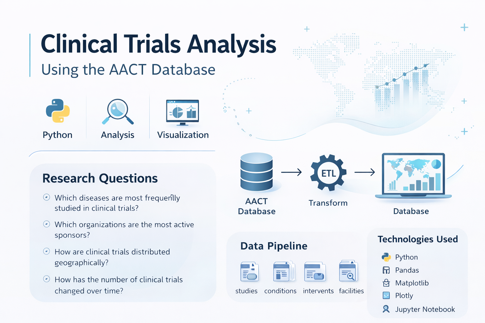

# Clinical Trials Analysis using the AACT Database

## Project Overview

This project analyzes publicly available clinical trial data from the **AACT (Aggregate Analysis of ClinicalTrials.gov) database**. The goal is to explore global patterns in biomedical research, including disease focus, sponsor activity, geographic distribution, and temporal trends in clinical trials.

The project demonstrates a full data analysis workflow including **data extraction, cleaning, transformation, integration, and visualization** using Python.

This work highlights how data analytics can support insights into clinical research trends and pharmaceutical innovation.

---

## Research Questions

The analysis focuses on four main questions:

1. Which diseases are most frequently studied in clinical trials?
2. Which organizations are the most active sponsors of clinical trials?
3. How are clinical trials distributed geographically?
4. How has the number of clinical trials changed over time?

---

## Dataset

The dataset comes from the **AACT database**, which aggregates data from ClinicalTrials.gov.

The following tables were used:

- `studies`
- `conditions`
- `interventions`
- `facilities`
- `sponsors`

These tables were merged using the clinical trial identifier:

---

## Data Pipeline

The analysis pipeline includes the following steps:

1. Download clinical trial dataset from AACT
2. Load data into Python using pandas
3. Clean and preprocess data
4. Merge multiple tables using trial identifiers
5. Select relevant features for analysis
6. Perform exploratory data analysis
7. Generate visualizations to identify trends

---

## Technologies Used

- Python
- Pandas
- Matplotlib
- Plotly
- Jupyter Notebook
- Git
- GitHub

---

## Example Insights

The project explores several aspects of clinical research:

- Disease areas with the highest number of clinical trials
- Distribution of sponsor types (industry, academic, government)
- Global distribution of clinical trials by country
- Growth of clinical research over time

These insights provide an overview of how biomedical research is distributed across diseases, regions, and institutions.

---

## Project Structure

clinical-trials-analysis/

data/
studies.txt
conditions.txt
interventions.txt
facilities.txt
sponsors.txt

notebooks/
clinical_trials_analysis.ipynb

src/
data_cleaning.py
analysis.py

README.md
requirements.txt

---

## Motivation

With a background in **molecular and cell biology**, this project represents a transition toward **biomedical data analytics**. It demonstrates how biological expertise can be combined with data science tools to analyze large-scale biomedical datasets and extract meaningful insights.

---

## Future Improvements

Possible extensions of the project include:

- Machine learning models to predict trial success
- Disease burden vs research activity comparison
- Network analysis of sponsors and research institutions
- Natural language processing of trial descriptions
